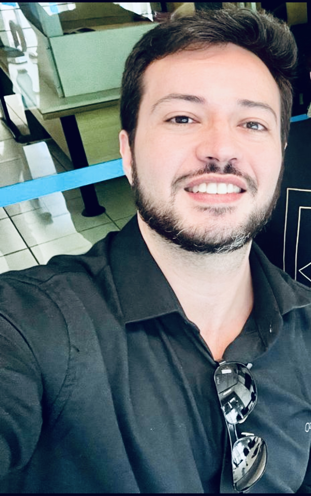

The event will be live on Youtube/Twitch (link soon).

Time zone in Porto de Galinhas, Brazil (GMT-3) .

## Session A: LEVEL 1 - GAME TESTING
> 9:00-10:30

* (11:45-12:30) Ciprian Paduraru, Alin Stefanescu and Augustin Jianu. **Unit test generation using large language models for Unity game development**
* (14:00-14:45) Patric Feldmeier and Gordon Fraser. **Combining Neuroevolution with the Search for Novelty to Improve the Generation of Test Inputs for Games**

## Session B: LEVEL 2 - GAME DEVELOPMENT
> 11:00-12:30

* (11:00-11:45) Stefano Campanella, Emanuela Guglielmi, Rocco Oliveto, Gabriele Bavota and Simone Scalabrino. **Towards the Automatic Replication of Gameplays to Support Game Debugging**
* (14:45-15:30) Xiaozhou Li, Valentina Lenarduzzi and Davide Taibi. **A Data-driven Analysis of Player Personalities for Different Game Genres**

## Session C: BOSS FIGHT - KEYNOTE
> 14:00-15:30 

**Prof. Rodrigo Santos**

Head of Complex Systems Engineering Lab

Associate Professor of Information Systems

### Title: Software Ecosystems in Industry

Abstract: The globalization of the software industry creates business opportunities for organizations that acquire and offer IT products and services in several domains, including digital games. However, the growing dependency on the networks of suppliers and external developers to reach organizational objectives and to analyze diversified stakeholders' demands brings several challenges. The reason is the fact that the set of technologies and applications – extensible and/or integrated – forms a common technological platform that joins a community of suppliers, external developers and users, generating networks known as software ecosystems (SECO). An important concern refers to SECO modeling and analysis since IT managers should make decisions based on a systemic perspective. In this talk, we aim to introduce some concepts and factors that affect SECO modeling and analysis in industry. In addition, some SECO implications on the applied software engineering for games will be pointed out.

Bio: Rodrigo Santos is an Associate Professor at the Department of Applied Informatics at the Federal University of the State of Rio de Janeiro (UNIRIO) and Research Productivity Fellow Level 2 by the Brazilian National Council for Scientific and Technological Development (CNPq). PhD in Software Engineering from the Federal University of Rio de Janeiro (COPPE/UFRJ). He was Academic Visitor at University College London (UCL) and Postdoc Researcher at COPPE/UFRJ. Head of the Complex Systems Engineering Laboratory (LabESC), leading a team of 20 students with more than 30 partners over the world. His research interests are Complex Systems Engineering (especially software ecosystems and systems-of-systems) and Software Engineering Education. He is the steering committee chair for SESoS@ICSE and was guest editor for special issues/sections for Information and Software Technology (Elsevier), Journal of Software: Evolution and Process (Wiley), Communications in Computer and Information Science (Springer), Journal of Internet Services and Applications (SBC & Springer), and Journal of the Brazilian Computer Society (SBC & Springer). He also served as PC member for ICSE-SEET, ICSE-SCORE. SESoS, ECSA, MODELS, ICSOB, CIbSE, IWSiB, ECIS, ACM MEDES etc., and as reviewer for IEEE TSE, JSS, IST, COMIND, ESWA, SCP, JSEP, FGCS, IJDRR etc.

## Session D: CONTINUE?
> 16:00-18:00

Round table discussion.

Challenges and opportunities in software engineering for game development.

<!-- Start	End	Event
9:00	10:30	Keynote Rodrigo
10:30	10:30	Break
11:00	11:45	Stefano Campanella, Emanuela Guglielmi, Rocco Oliveto, Gabriele Bavota and Simone Scalabrino. Towards the Automatic Replication of Gameplays to Support Game Debugging
11:45	12:30	Ciprian Paduraru, Alin Stefanescu and Augustin Jianu. Unit test generation using large language models for Unity game development
12:30	14:00	Break
14:00	14:45	Patric Feldmeier and Gordon Fraser. Combining Neuroevolution with the Search for Novelty to Improve the Generation of Test Inputs for Games
14:45	15:30	Xiaozhou Li, Valentina Lenarduzzi and Davide Taibi. A Data-driven Analysis of Player Personalities for Different Game Genres
15:30	16:00	Break
16:00	18:00	Round table discussion + Wrap up -->

<!-- ## Morning Sessions

* Welcome and Introductions
* Keynote Speaker (Academia)
* Session 1: Presentations and Discussions 
* Break
* Session 2: Presentations and Discussions

## Afternoon Sessions

* Keynote Speaker (Industry)
* Session 3: Presentations and Discussions
* Break
* Session 4: Presentations and Discussions
* Roundtable
* Call to Action and Wrap-up -->

